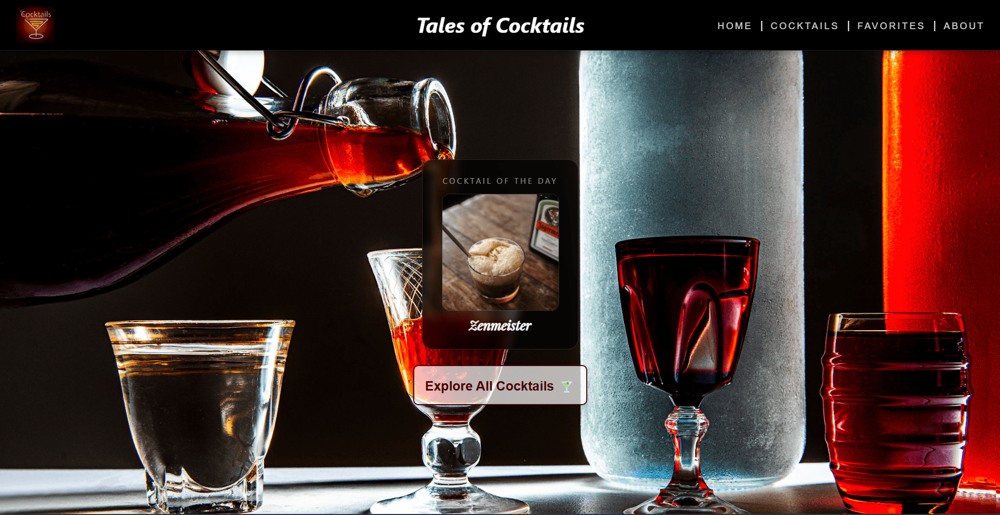
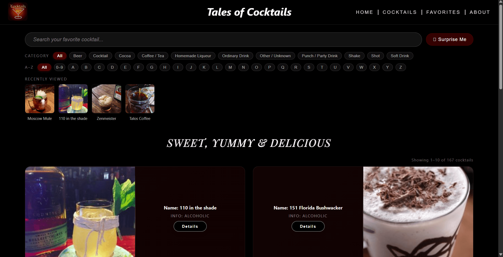
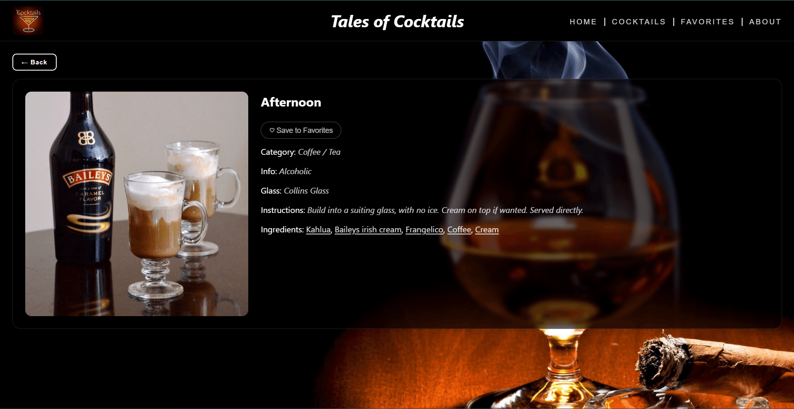
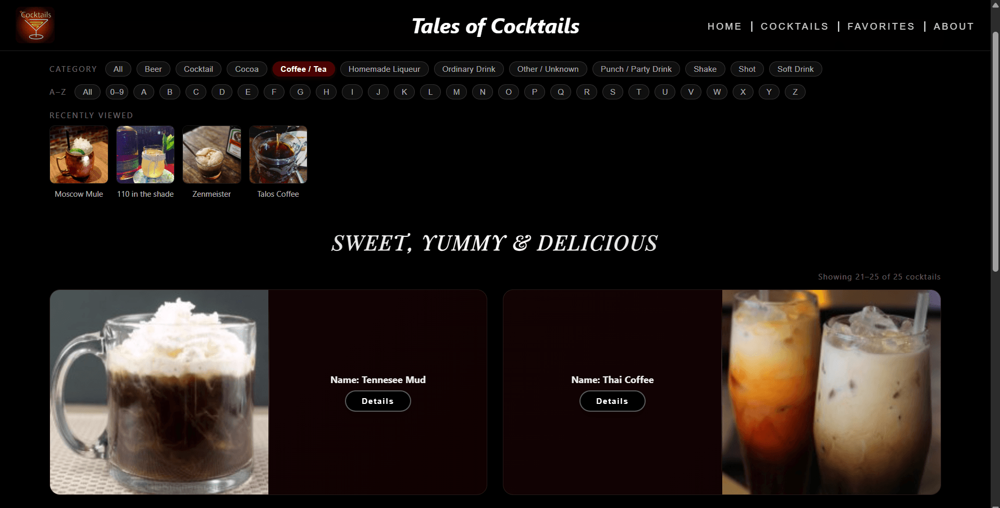
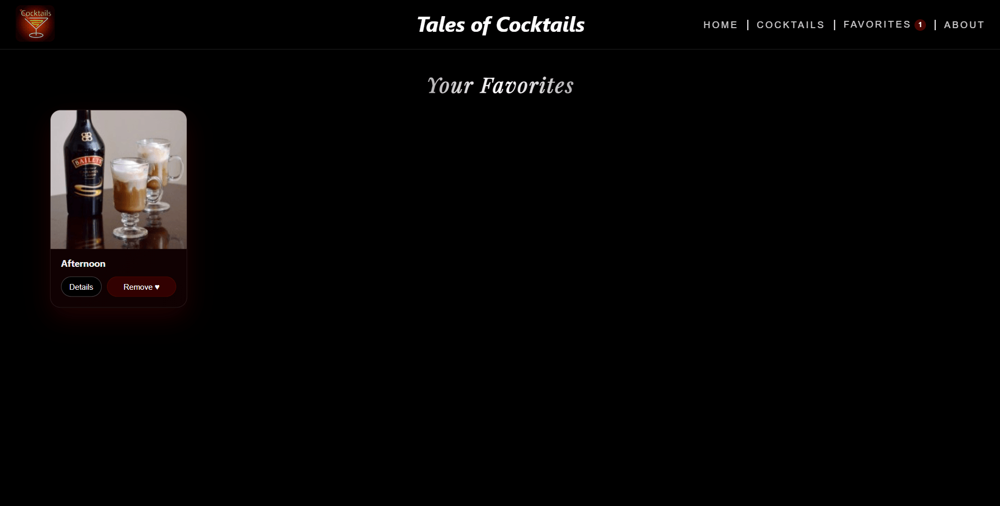
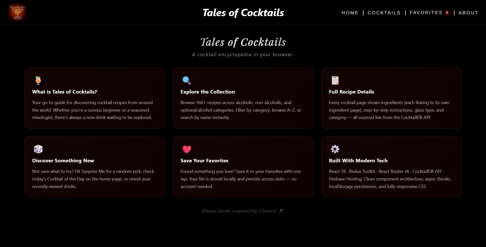

# 🍸 Tales of Cocktails

A modern cocktail encyclopedia built with **React 19**, **Redux Toolkit**, and
**Vite**. Browse 160+ cocktail recipes, filter by category or letter, search by
name, save your favorites, and discover something new with Surprise Me or the
daily Cocktail of the Day.

[](https://tales-of-cocktails.web.app/)
[](https://react.dev/)
[](https://redux-toolkit.js.org/)
[](https://vitejs.dev/)
[](https://firebase.google.com/)

## ✨ Features

- **🔍 Smart Search** — Real-time search with debounced input
- **🏷️ Category Filters** — Filter by drink category (Ordinary Drink, Cocktail,
  Shot, etc.)
- **🔤 A-Z Navigation** — Browse cocktails alphabetically or by numbers (0-9)
- **❤️ Favorites** — Save cocktails to your favorites with localStorage
  persistence
- **👀 Recently Viewed** — Quick access to your last 5 viewed cocktails
- **🎲 Surprise Me** — Get a random cocktail recommendation
- **📅 Cocktail of the Day** — Fresh daily recommendation on the home page
- **📖 Ingredient Pages** — Detailed ingredient info with related cocktails
- **📱 Fully Responsive** — Works great on mobile, tablet, and desktop
- **🍔 Mobile Navigation** — Hamburger menu for smaller screens
- **⚡ Lazy Loading** — Route-based code splitting for faster initial load
- **💀 Loading Skeletons** — Smooth loading states instead of spinners

## 📸 Screenshots

| Home                                   | Cocktails                                   | Detail                                   |
| -------------------------------------- | ------------------------------------------- | ---------------------------------------- |
|  |  |  |

| Filters                                   | Favorites                                   | About                                   |
| ----------------------------------------- | ------------------------------------------- | --------------------------------------- |
|  |  |  |

## 🛠️ Tech Stack

| Category             | Technologies                                           |
| -------------------- | ------------------------------------------------------ |
| **Frontend**         | React 19, React Router v6                              |
| **State Management** | Redux Toolkit, React-Redux                             |
| **Styling**          | SCSS with variables & mixins                           |
| **Build Tool**       | Vite 5                                                 |
| **API**              | [TheCocktailDB](https://www.thecocktaildb.com/api.php) |
| **Hosting**          | Firebase Hosting                                       |

## 🏗️ Project Structure

```
src/
├── components/          # Reusable UI components
│   ├── CocktailList/    # Cocktail grid with cards
│   ├── ErrorBoundary/   # Error boundary wrapper
│   ├── Filters/         # Category & A-Z filters
│   ├── Header/          # Navigation with hamburger menu
│   ├── Pagination/      # Page navigation
│   ├── RecentlyViewed/  # Recently viewed strip
│   ├── Search/          # Search input with debounce
│   └── Skeleton/        # Loading skeleton components
├── hooks/               # Custom React hooks
│   ├── useDebounce.js
│   ├── useFavorites.js
│   ├── useLocalStorage.js
│   └── useRecentlyViewed.js
├── pages/               # Route pages
│   ├── About/
│   ├── Cocktails/
│   ├── Favorites/
│   ├── Home/
│   ├── Ingredient/
│   ├── NotFound/
│   └── SingleCocktail/
├── redux/               # Redux store & slices
│   ├── features/
│   │   ├── cocktailSlice.js
│   │   └── favoritesSlice.js
│   └── store.js
├── services/            # API layer
│   └── cocktailApi.js
├── styles/              # Global SCSS
│   ├── _variables.scss
│   └── main.scss
├── App.jsx
└── main.jsx
```

## 🚀 Getting Started

### Prerequisites

- Node.js 18+
- npm or yarn

### Installation

```bash
# Clone the repository
git clone https://github.com/yourusername/tales-of-cocktails.git

# Navigate to project directory
cd tales-of-cocktails

# Install dependencies
npm install

# Start development server
npm run dev
```

The app will open at [http://localhost:3000](http://localhost:3000)

### Build for Production

```bash
# Create optimized build
npm run build

# Preview production build locally
npm run preview
```

### Code Quality

```bash
# Lint the codebase (fails on any warning)
npm run lint

# Format all source files with Prettier
npm run format

# Verify formatting without writing changes
npm run format:check
```

### Deploy to Firebase

```bash
# Install Firebase CLI if needed
npm install -g firebase-tools

# Login once
firebase login

# Build and deploy in one step
npm run deploy
```

## 📝 API Reference

This project uses the free
[TheCocktailDB API](https://www.thecocktaildb.com/api.php). Key endpoints:

| Endpoint                     | Description              |
| ---------------------------- | ------------------------ |
| `/search.php?s={name}`       | Search by cocktail name  |
| `/lookup.php?i={id}`         | Get cocktail by ID       |
| `/filter.php?c={category}`   | Filter by category       |
| `/filter.php?a={type}`       | Filter by alcoholic type |
| `/filter.php?i={ingredient}` | Filter by ingredient     |
| `/search.php?f={letter}`     | Search by first letter   |
| `/random.php`                | Get random cocktail      |
| `/list.php?c=list`           | List all categories      |

## 🎯 Key Implementation Details

### Custom Hooks

- **useDebounce** — Debounces search input to prevent excessive API calls
- **useFavorites** — Manages favorites with Redux integration
- **useLocalStorage** — Syncs state with localStorage
- **useRecentlyViewed** — Tracks last 5 viewed cocktails

### State Management

Redux Toolkit handles:

- Cocktail list with pagination
- Single cocktail details
- Categories
- Filters (category, letter, digits)
- Ingredient data
- Loading/error states

### Performance Optimizations

- Route-based code splitting with `React.lazy()`
- Memoized selectors
- Debounced search
- Lazy loaded images
- Chunked vendor bundles (Vite)

## 📄 License

MIT License — feel free to use this project for learning or as a portfolio
piece.

## 🙏 Credits

- Cocktail data: [TheCocktailDB](https://www.thecocktaildb.com/)
- Icons: Native emojis
- Background image: [Source](https://www.thespruceeats.com/)
